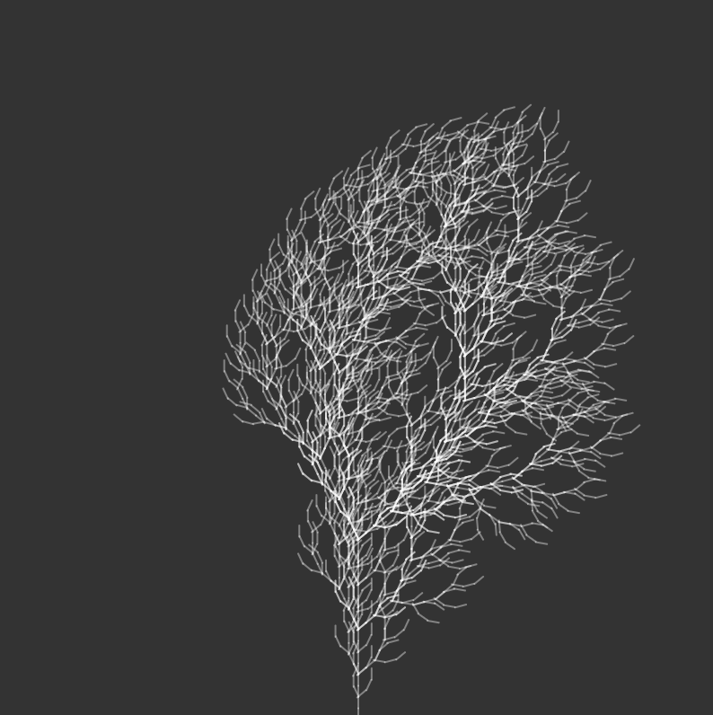
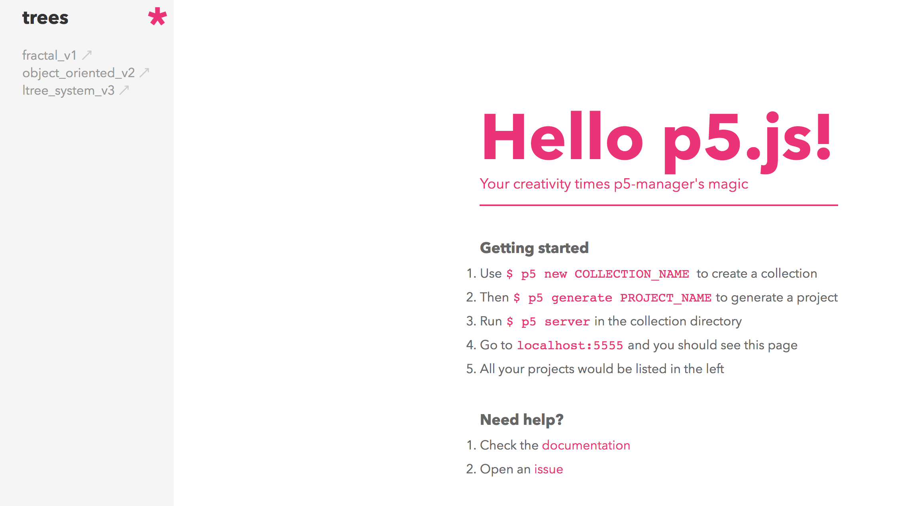

<p align="center">
    
</p>

## Setup

```bash
sh install.sh
```

## Creating a new collection / projects within it

Use the wonderful [`p5-manager`](https://www.npmjs.com/package/p5-manager) package.

```bash
# create a new collection
$ p5 new <collection-name>

# now create a project (a sketch) with this collection
$ cd <collection-name>
$ p5 generate <project-name>
```

## Collections

## `trees`

1. [`trees/fractal_v1`](https://editor.p5js.org/fractal/sketches/rJdsWG-JV)
1. [`trees/object_oriented_v2`](https://editor.p5js.org/fractal/sketches/ry9hOz-1V)
1. [`trees/ltree_system_v3`](https://editor.p5js.org/fractal/sketches/B1xFGWfkN)

## Running a project

```bash
$ cd <collection-name>
$ p5 server --port 7890
```

Then open up the browser [`http://localhost:7890`](http://localhost:7890).

Server will automatically reload the browser whenever you make changes:

<p align="center">
    
</p>

